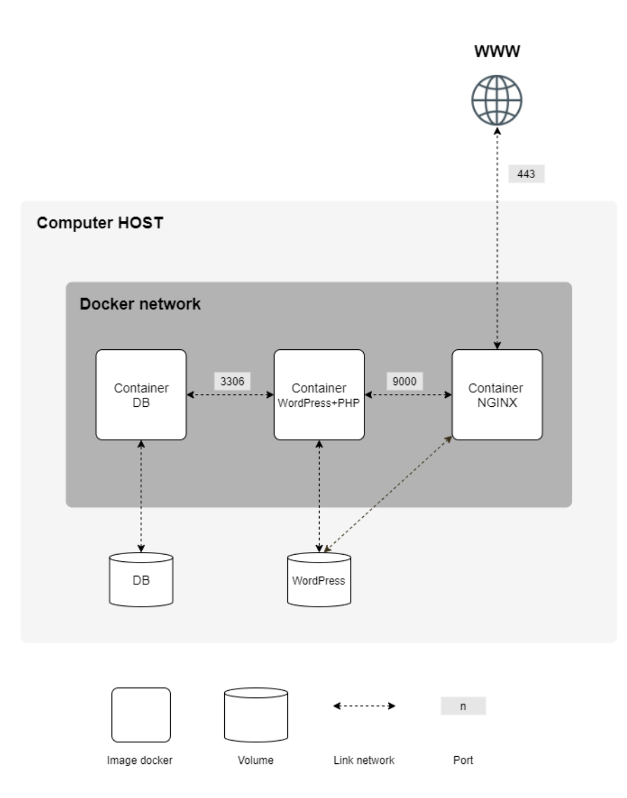

# inception

Mock project to build and deploy docker network with custom docker images.  
All "sensitive" data is one stored in .env file and not in any of dockerfiles/entrypoint scripts.

Containers:
1. nginx with TLS v1.2 or v1.3 at port 443 (v)
2. wordpress and php-fpm at port 9000 (v)
3. mariadb at port 3306 (v)
4. redis cache for wordpress at port 6379 (v)
5. ftp server: pointing to wordpress volume at port 21 (v)
6. adminer at port 8080 (v)
7. static site with a mock resume at port 4000 (v)
8. docker stats service at port 8080 (v)

Volumes:
1. wordpress database: avaliable to mariadb
2. wordpress website files: avaliable to wp and nginx
-> volumes at /home/bteak/data

Docker-network

Auto-restart containers

Wordpress database: two users. administrator + user
domain name pointing to localhost: bteak.42.fr

## Scheme
  
